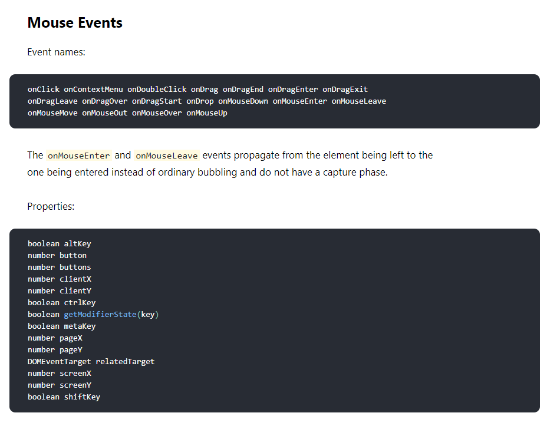

# Event Handling

* Event의 기본적인 설명은 생략


#### React에서 이벤트 작성 시 주의 사항

* 이벤트 이름은 카멜 표기법

  * `onClick , onKeyUp` 등..

  > 카멜 표기법 : 여러 단어로 구성된 이름의 경우, 첫 단어를 제외하고 각 단어의 첫 글자만 대문자로 지정해주는 표기법

* 이벤트 실행시 JS코드를 전달하는 것이 아닌, 함수 형태의 값을 전달

  * 함수 형태의 객체를 전달하는 것 (Component 정리본에서 )

* DOM 요소에만 이벤트 설정

  * 우리가 직접 만든 컴포넌트에는 이벤트를 자체적로 설정할 수 없다.

  * `<div>,<button>,<input>,<form>,<span>` 등 DOM 요소에만 이벤트 설정 가능

  * `<MyComponent onClick={ --something-- }/>` 의 경우, onClick이라는 변수에 someThing으로 설정하는 것..

    `<div onClick ={this.props.onClick}></div>` 이런식으로 되어야함!

* 이벤트 요소는 https://facebook.github.io/react/docs/events.html 확인
  

  > MouseEvents Docs

**이벤트 예제 코드**

```react
import React , {Component} from "react";

class EventPractice extends Component{
    state = {
        message : ''
    }
    render() {
        return (
            <div>
                <h1> Event Practice </h1>
                <input type="text" name="message" placeholder="inputs" value = {this.state.message} onChange={
                    (e) => {
                        console.log(e.target.value);
                        this.setState({
                            message : e.target.value
                        })
                    }
                }>
                </input>
                <button onClick={()=>{
                    alert(this.state.message);
                    this.setState({
                        message:''
                    });
                }}>Check Message</button>
            </div>
        );
    }
}

export default EventPractice;
```

**임의 메서드 만들기**

* 컴포넌트 내에 메서드를 만들고 그것을 값을 전달

* Code

  ```react
  import React , {Component} from "react";
  
  class EventPractice extends Component{
      state = {
          message : ''
      }
      constructor(props){
          super(props);
          this.handleChange = this.handleChange.bind(this);
          this.handleClick = this.handleClick.bind(this); // ??
      }
      handleChange(e){
          this.setState({
              message : e.target.value
          });
      }
      handleClick(){
          alert(this.state.message);
          this.setState({
              message:''
          });
      }
      render() {
          return (
              <div>
                  <h1> Event Practice </h1>
                  <input type="text" name="message" placeholder="inputs" value = {this.state.message} onChange={this.handleChange}>
                  </input>
                  <button onClick={this.handleClick}>Check Message</button>
              </div>
          );
      }
  }
  
  export default EventPractice;
  ```
  * 임의 메서드가 이벤트로 등록할 때 메서드와 this를 binding 해준다.

    * bind를 해주지 않을 시 undefined을 가리킴

  * 메서드 바인딩은 생성자에 해주는게 정석이지만, `transform-class-properties` 문법을 사용해서 화살표 함수 형태로 메서드를 정의

    ```react
    handleChange = (e)=>{
            this.setState({
                message : e.target.value
            });
        }
    handleClick = () => {
        alert(this.state.message);
        this.setState({
            message:''
        });
    }
    ```

    * 위와 같이 해주면 constructor에 해주지 않아도 된다.

* 객체 안에서 key를 [   ]로 감싸면 그 안에 넣은 레퍼런스가 가리키는 실제 값이 key 값으로 사용

  ```react
  const name = "variantKey";
  const object ={
      [name] : "value" //이 경우 위의 name을 가리킴
  };
  //결과
  {
      'variantKey' : "value"
  }
  ```


**함수형 컴포넌트로 구현**

* ```react
  import React , {Component,useState} from "react";
  
  const EventPractice = () =>{
      const [username,setUsername] = useState('');
      const [message,setMessage] = useState('');
      const onChangeUsername = e => setUsername(e.target.value);
      const onChangeMessage = e => setMessage(e.target.value);
      const onClick = () => {
          alert(username+ ': '+ message);
          setUsername('');
          setMessage('');
      };
      const onKeyPress =e => {
          if (e.key === "Enter"){
              onClick();
          }
      };
      return (
          <div>
              <h1>Event Practice</h1>
              <input
               type = 'text'
               name = 'username'
               placeholder = 'User_Name'
               value ={username}
               onChange={onChangeUsername}></input>
               <input
                tpye='text'
                name = 'message'
                placeholder='input anyone'
                value ={message}
                onChange={onChangeMessage}
                onKeyPress={onKeyPress}></input>
              <button onClick={onClick}>Check!</button>
          </div>
      );
  };
  
  export default EventPractice;
  ```
  * onChangeUsername, onChangeMessage, onClick, onKeyPress
    * Event 메소드
    * EventPractice는 함수형 컴포넌트


